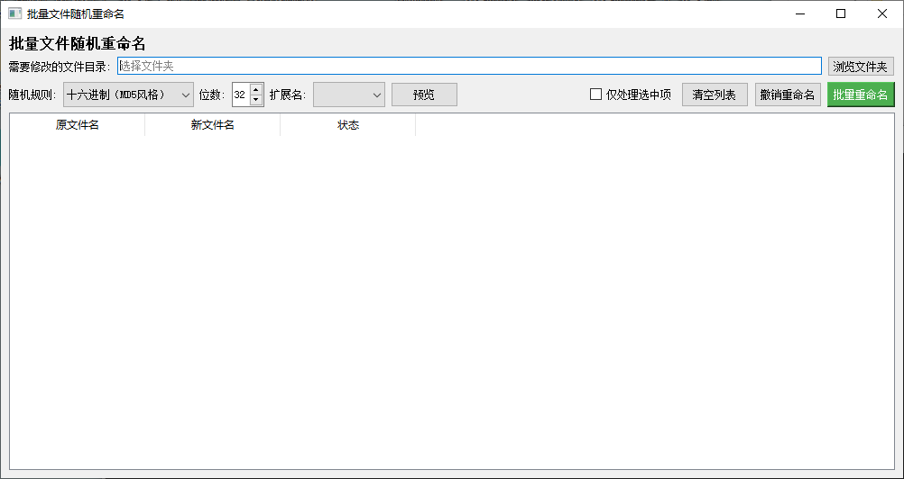

# 批量文件随机重命名工具 功能说明

## 一、工具概述

批量文件随机重命名工具是一个基于 PyQt5 的桌面应用程序，用于对指定文件或文件夹中的文件批量生成随机文件名，并执行重命名操作。工具支持文件拖拽添加、文件夹递归添加、随机规则选择、随机位数设置、扩展名替换、预览、批量重命名、撤销重命名、仅处理选中项等功能。

程序主窗口标题为“批量文件随机重命名”，主要用于快速将文件原名替换为随机字符串，同时可选择保留原扩展名或强制使用指定扩展名。

## 二、主界面组成

主界面由标题、目录选择区、随机规则区、操作按钮区、文件表格区组成。

### 1. 标题区

显示文字：

> 批量文件随机重命名

用于标识当前工具用途。

### 2. 目录选择区

包含以下控件：

| 控件 | 说明 |
| --- | --- |
| 需要修改的文件目录 | 文本输入框，用于显示选择的文件夹路径 |
| 浏览文件夹 | 按钮，点击后弹出文件夹选择对话框 |

选择文件夹后，程序会将该文件夹路径显示在输入框中，并递归读取该文件夹及其子文件夹中的全部文件，添加到文件列表。

### 3. 随机规则区

包含以下控件：

| 控件 | 说明 |
| --- | --- |
| 随机规则 | 下拉框，用于选择随机文件名的字符规则 |
| 位数 | 数字调节框，用于设置随机字符串长度，范围为 1 到 64，默认值为 32 |
| 扩展名 | 下拉框，用于选择是否替换文件扩展名 |
| 预览 | 按钮，点击后根据当前规则生成新文件名预览 |

随机规则下拉框包含：

1. 十六进制（MD5风格）
2. 随机字母(大小写随机)
3. 随机字母(大写)
4. 随机字母(小写)
5. 随机数字

扩展名下拉框包含：

1. 空白
2. JPG
3. PNG
4. DOC
5. DOCX
6. XLS
7. XLSX
8. TXT
9. RTF
10. PPT
11. PPTX

其中，空白表示不改变原文件扩展名；选择具体扩展名后，会将新文件名扩展名替换为所选扩展名，并统一转换为小写形式。

### 4. 操作按钮区

包含以下控件：

| 控件 | 说明 |
| --- | --- |
| 仅处理选中项 | 复选框，勾选后预览、批量重命名、撤销重命名只作用于表格中选中的行 |
| 清空列表 | 按钮，清空当前文件列表和重命名历史 |
| 撤销重命名 | 按钮，根据历史记录撤销已经完成的重命名 |
| 批量重命名 | 按钮，按照预览或自动生成的新文件名执行批量重命名 |

### 5. 文件表格区

表格包含三列：

| 列名 | 说明 |
| --- | --- |
| 原文件名 | 显示文件当前名称 |
| 新文件名 | 显示预览或即将使用的新文件名 |
| 状态 | 显示当前处理状态 |

表格垂直表头显示行号，并居中显示。表格支持整行选择，支持将文件或文件夹拖拽到表格中。

## 三、文件添加方式

工具支持两种添加文件的方式。

### 1. 通过“浏览文件夹”添加

点击“浏览文件夹”按钮后，选择目标文件夹。程序会递归遍历该文件夹及其所有子文件夹，将其中所有文件加入列表。

### 2. 通过拖拽添加

将文件或文件夹拖拽到表格区域即可添加。

- 拖入单个或多个文件时，文件会直接加入列表。
- 拖入文件夹时，程序会递归读取该文件夹中的所有文件并加入列表。
- 不存在的路径会被忽略。
- 已经添加过的文件不会重复加入。
- 文件路径会被转换为绝对路径并规范化处理。

## 四、随机命名规则

程序根据“随机规则”和“位数”生成随机字符串。

| 随机规则 | 使用字符 |
| --- | --- |
| 十六进制（MD5风格） | 0-9、a-f |
| 随机字母(大小写随机) | 大小写英文字母 |
| 随机字母(大写) | 大写英文字母 |
| 随机字母(小写) | 小写英文字母 |
| 随机数字 | 0-9 |

随机字符串长度由“位数”控制，范围为 1 到 64，默认 32 位。

生成的新文件名格式为：

> 随机字符串 + 扩展名

原文件的基础名称不会保留。

## 五、扩展名处理

扩展名处理规则如下：

| 扩展名下拉框选择 | 处理结果 |
| --- | --- |
| 空白 | 保留原文件扩展名 |
| JPG、PNG、DOC 等具体扩展名 | 使用所选扩展名，并转换为小写 |

例如：

- 原文件名为 `photo.JPEG`，扩展名选择空白，则新文件名保留 `.JPEG`。
- 原文件名为 `photo.JPEG`，扩展名选择 `JPG`，则新文件名扩展名变为 `.jpg`。
- 原文件名为 `data.txt`，扩展名选择 `PNG`，则新文件名扩展名变为 `.png`。

## 六、预览功能

点击“预览”按钮后，程序会根据当前随机规则、位数和扩展名设置生成新文件名。

预览规则：

1. 如果文件列表为空，会提示“列表为空，请先添加文件”。
2. 如果勾选了“仅处理选中项”：
   - 必须先选中表格中的行。
   - 如果没有选中行，会提示“请先选中要预览的行”。
   - 只为选中的行生成预览。
3. 如果未勾选“仅处理选中项”：
   - 为列表中全部文件生成预览。
4. 生成预览后：
   - “新文件名”列显示生成的新文件名。
   - “状态”列显示为“预览”。
5. 重复点击预览会重新生成并覆盖之前的新文件名。

## 七、批量重命名

点击“批量重命名”按钮后，程序会执行实际文件重命名操作。

处理流程：

1. 如果文件列表为空，会提示“列表为空，请先添加文件”。
2. 如果勾选了“仅处理选中项”：
   - 必须先选中表格中的行。
   - 如果没有选中行，会提示“请先选中要重命名的行”。
   - 只处理选中的行。
3. 如果未勾选“仅处理选中项”：
   - 处理列表中全部文件。
4. 对于每个目标文件：
   - 如果“新文件名”为空，则自动生成随机新文件名。
   - 如果“新文件名”已有内容，则保留该名称。
   - 状态会更新为“待重命名”。
5. 弹出确认对话框，显示即将重命名的文件数量。
6. 用户确认后开始重命名。
7. 重命名时：
   - 新文件路径由原文件所在目录和新文件名组成。
   - 如果目标路径已经存在，程序会自动追加 `_1`、`_2`、`_3` 等序号，直到文件名不冲突。
   - 成功重命名后，记录历史记录。
   - 表格中的“原文件名”会更新为新文件名。
   - 文件路径会更新为新路径。
   - 状态显示为“成功”。
   - 如果失败，状态显示为“失败: 错误信息”。
8. 完成后弹出提示，显示成功数量和失败数量。

重命名只改变文件名，不会移动文件到其他目录。文件仍保留在原所在文件夹中。

## 八、撤销重命名

点击“撤销重命名”按钮后，程序会根据历史记录将文件恢复为旧文件名。

历史记录只记录成功执行的重命名操作，每条记录包含：

- 旧路径
- 新路径

撤销规则：

### 1. 未勾选“仅处理选中项”

1. 如果没有历史记录，会提示“没有可撤销的操作”。
2. 如果存在历史记录，会弹出确认对话框，提示将撤销所有历史记录。
3. 用户确认后，程序按历史记录逆序撤销。
4. 每个文件从新路径改回旧路径。
5. 撤销成功后：
   - 表格中的文件路径恢复为旧路径。
   - “原文件名”恢复为旧文件名。
   - “新文件名”清空。
   - 状态显示为“已撤销”。
6. 如果某个文件撤销失败，会弹出错误提示。
7. 完成后提示成功撤销数量。

### 2. 勾选“仅处理选中项”

1. 必须先选中表格中的行。
2. 如果没有选中行，会提示“请先选中要撤销的行”。
3. 程序会查找选中行当前文件路径是否匹配历史记录中的新路径。
4. 如果没有匹配的历史记录，会提示“选中的文件没有可撤销的历史记录”。
5. 对匹配到的历史记录按索引倒序撤销。
6. 撤销成功后更新表格状态为“已撤销”。
7. 完成后提示成功撤销数量。

注意：清空列表会同时清空重命名历史记录，清空后无法再撤销。

## 九、清空列表

点击“清空列表”按钮后：

- 清空当前文件列表。
- 清空重命名历史记录。
- 清空表格显示内容。

该操作不会删除或修改实际文件，只会清除当前界面中的待处理列表和撤销历史。

## 十、拖拽支持

表格区域支持拖放操作。

- 表格作为拖放目标，只接受拖入，不支持从表格拖出。
- 拖入文件时，文件会被添加到列表。
- 拖入文件夹时，会递归读取文件夹中的文件并添加到列表。
- 拖放过程中显示拖放指示。
- 只处理本地文件路径。

## 十一、表格与状态说明

表格列说明：

| 列名 | 内容 |
| --- | --- |
| 原文件名 | 当前文件名称 |
| 新文件名 | 预览或即将使用的新名称 |
| 状态 | 当前处理状态 |

常见状态包括：

| 状态 | 含义 |
| --- | --- |
| 待处理 | 文件刚加入列表，尚未处理 |
| 预览 | 已生成预览新文件名 |
| 待重命名 | 已准备执行重命名 |
| 成功 | 重命名成功 |
| 失败: 错误信息 | 重命名失败，并显示原因 |
| 已撤销 | 已恢复为旧文件名 |

## 十二、典型操作流程

1. 打开程序。
2. 通过“浏览文件夹”选择目录，或将文件、文件夹拖拽到表格中。
3. 在“随机规则”中选择随机字符规则。
4. 设置随机字符串“位数”。
5. 选择是否替换“扩展名”。
6. 根据需要勾选“仅处理选中项”，并在表格中选择目标行。
7. 点击“预览”查看生成的新文件名。
8. 点击“批量重命名”。
9. 在确认对话框中确认执行。
10. 如需恢复，点击“撤销重命名”。
11. 如需重新开始，点击“清空列表”。

## 十三、注意事项

1. 重命名只发生在文件所在目录，不会跨目录移动文件。
2. 扩展名选择空白时保留原扩展名，选择具体扩展名时会替换原扩展名。
3. 如果目标文件名已存在，程序会自动追加数字序号避免冲突。
4. 撤销功能依赖程序当前运行期间的历史记录，清空列表后历史记录也会被清空。
5. 勾选“仅处理选中项”后，预览、批量重命名、撤销重命名都只针对选中行。
6. 拖入文件夹时会递归包含子文件夹中的文件。
7. 已添加过的相同路径文件不会重复加入列表。
8. 不存在的文件路径会被忽略。
9. 批量重命名前建议先预览，确认新文件名和扩展名符合预期。
10. 对重要文件执行批量重命名前，建议先备份。
